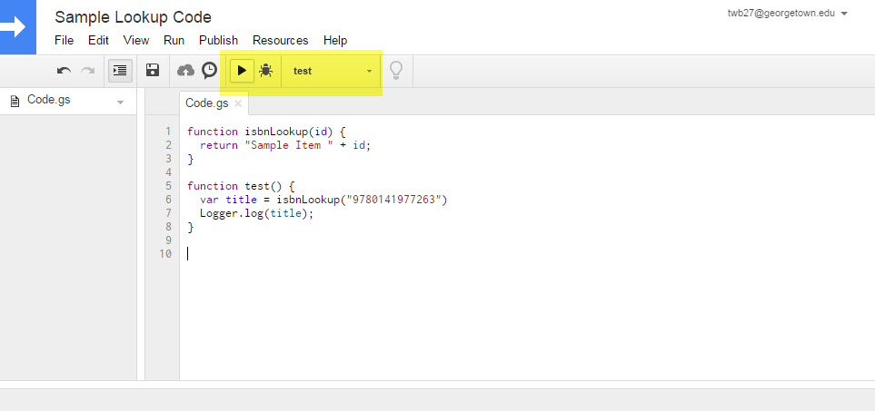
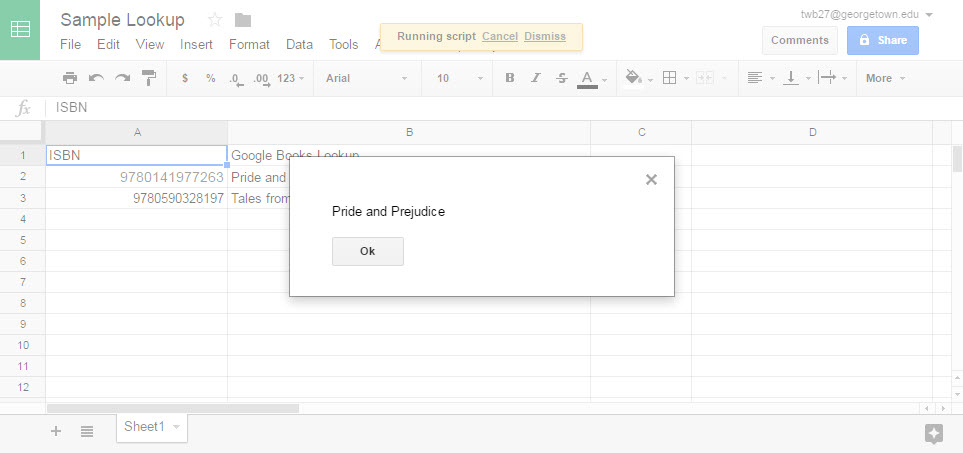
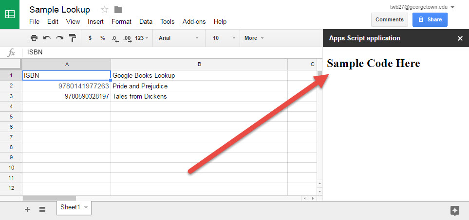
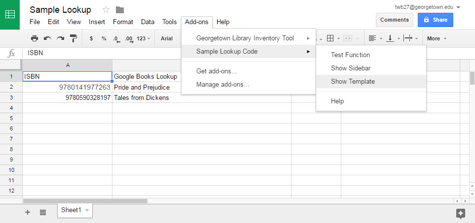
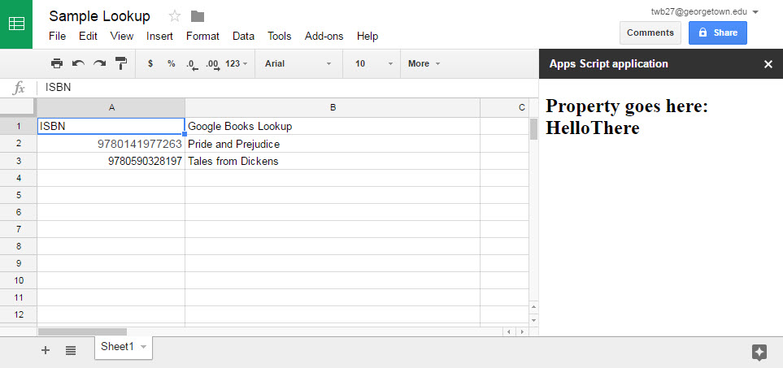

#HSLIDE
### What is Google App Script?
Google App Script is a server-side implementation of JavaScript with access to several Google API's.

[Google Apps Script Documentation](https://developers.google.com/apps-script/)

#HSLIDE

### How can Google App Script be Used?
- Accessible as a standalone Google Script project on Google Drive
- Embedded in a Google Document, a Google Sheet, a Google Form, or a Google Site
- Packaged for the Chrome Store as an Add-On
  
#VSLIDE
#### Accessible as a standalone Google Script project on Google Drive
- Runnable on demand from the script editor
- Deployable as a web service
- Schedulable as a trigger (time-driven)

#VSLIDE
#### Embedded in a Google Document, a Google Sheet, a Google Form, or a Google Site
- Runnable from a custom menu item
- Triggered by a user event (on Edit/on Open action)
- Available as a spreadsheet formula
- All of the standalone script options are also available for embedded scripts

#VSLIDE
#### Packaged for the Chrome Store as an Add-On
- Offered for Sale to the Public
- Offered for Free to the Public
- Offered for Free to your Apps Domain
- Offered Privately by URL
  
#HSLIDE
### Why Use Google Apps Script?
- It is available where your users already are
  - No need to introduce another login
  - Sharable using existing Google Drive sharing options
  - Configuratable Authorization
  - User must authorize the permissions granted to the script
- Sometimes a Document or a Spreadsheet provides the correct level of complexity to solve a problem

#VSLIDE
Configuratable Authorization Options
- Script can run as the user running the script
- Script can run as the author of the script
- Script can be authorized to access personal Google Services (Mail, Calendar, Drive)


#HSLIDE
### Complete App Examples
- Building a Web Service to Save to Google Drive
- Extending Google Apps

#HSLIDE

### Example 1: A Web Service to Upload a CSV to Google Sheets
- Auto-correct in Excel and Google Sheets is a frequent problem for librarians editing metadata
- CSV files can be corrupted when shared between users
- [Sample Script Project](https://script.google.com/a/georgetown.edu/d/13HcFhMle_oIBTfhuZEya_zQHAokJjgZEdqTEoOTeEfrpx5UpTmNUh_pB/edit?usp=drive_web)
- [Code on Github](https://github.com/terrywbrady/PlainTextCSV_GoogleAppsScript)
- [Sample Screen Shots](https://github.com/Georgetown-University-Libraries/PlainTextCSV_GoogleAppsScript/blob/master/README.md)

#VSLIDE
#### Try it yourself
- [Sample Script Project](https://script.google.com/a/georgetown.edu/d/13HcFhMle_oIBTfhuZEya_zQHAokJjgZEdqTEoOTeEfrpx5UpTmNUh_pB/edit?usp=drive_web)
- Select "Make a Copy" to save an editable copy
- Click "Deploy as Webapp", set the run as parameters as appropriate to you
- Get the current web app URL
- Run the Web App to upload a CSV file

#HSLIDE
### Example 2: Weekly Scheduling with Google Sheets
- Volunteer assignment spreadsheet
- Volunteer coordinators had limited computer literacy
- [Sample Spreadsheet](https://docs.google.com/spreadsheets/d/1T_AnSoz893QY1IL9uH9L8mH220Wp6WE_Weaq3VkxOX4/edit#gid=0)
- [Code on GitHub](https://github.com/terrywbrady/OnlineRota_GoogleAppsScript)
- [Sample Screen Shots](https://github.com/terrywbrady/OnlineRota_GoogleAppsScript/blob/master/README.md)

#VSLIDE
####  Example 2: Try it yourself - Configuration
- [Sample Spreadsheet](https://docs.google.com/spreadsheets/d/1T_AnSoz893QY1IL9uH9L8mH220Wp6WE_Weaq3VkxOX4/edit#gid=0)
- Select "Make a Copy" to save an editable copy
- Create a personal Google Site
  - Create a page within the site named "rotasearch"
  - Set a script property named "siteid" with a URL to your new site 

#VSLIDE
####  Example 2: Try it yourself
- Make an edit
- Send email
- Publish to Google Sites.  See the following [example](https://sites.google.com/a/georgetown.edu/examples/rotasearch)
- Create a trigger to call "sendRota" on a daily basis
  
#VSLIDE
### Example 2: Trigger Menu


### Example 2: Create Trigger


### Example 2: Create Trigger


#HSLIDE
### Example 3A: Creating a Test Google Sheet With Fake ISBN Lookup
- Create a new Google Sheet
- Enter the following Data

|ISBN|Google Books Lookup|
|---|---|
|9780141977263||
|9780590328197||

#VSLIDE
### Example 3A: Create a Script within the Sheet
- Tools -> Script Editor
- This will open up the App Script Cloud IDE

#VSLIDE
### Example 3A: Add the following script code
```
function isbnLookup(id) {
    return "Sample ISBN Lookup " + id;
}
function test() {
  var title = isbnLookup("9780141977263")
  Logger.log(title);
}
```
#VSLIDE
### Example 3A: Save the Script Project
Name the project something like "Test Project"

#VSLIDE
### Example 3A: Test the script
From the "Select function" drop down, select "test" and click the "Run" or "Debug" button 


#VSLIDE
### ### Example 3A: View Log Output
Click "View Logs" to confirm that the function ran.


#VSLIDE
### Example 3A: Use the script as a Spreadsheet formula
- Modify cell B2 to contain the following formula `=isbnLookup(A2)`
- Copy cell B2 into cell B3 to create the following formula `=isbnLookup(A3)`
- Verify that the cell contents display the result of the function


#HSLIDE
### Example 3B: Enhance the script with an external service call
- [Google Apps Script API Reference for UrlFetchApp](https://developers.google.com/apps-script/reference/url-fetch/url-fetch-app)
- Update the isbnLookup function to use the [Google Books API](https://developers.google.com/books/docs/v1/using#web-applications) to lookup the isbn

#VSLIDE
### Example 3B: Call Google Books Service 
```
function isbnLookup(id) {
  var url = "https://www.googleapis.com/books/v1/volumes?country=US&q=isbn:"+id;
  var options = {contentType : "application/json"};
  var resp = UrlFetchApp.fetch(url, options);
  if (resp == null || resp == "") return "N/A";
  var respdata = JSON.parse(resp.getContentText());
  if (respdata["items"].length == 0) return "Not found";
  return respdata["items"][0]["volumeInfo"]["title"];
}
```

#VSLIDE
### Example 3B: Run the "test()" function again
- The first time you run this, you will need to authorize Google Apps to send data to an external URL
- Check the logs to verify that "Pride and Prejudice" was found

#VSLIDE
### Example 3B: Reload the Spreadsheet
- The Google Books lookups should now be present


#HSLIDE
### Example 3C: Enhance the Sheets UI
- Add the following code to Add Menu to Google Sheets
```
function onOpen(e) {
  SpreadsheetApp.getUi()
    .createAddonMenu()
    .addItem("Test Function", "test")
    .addToUi();
}
```

#VSLIDE
### Example 3C: Reload to See the New Menu


#VSLIDE
### Example 3C: Add UI Confirmation to the test() function
Modify the test() function to access the [Spreadsheet UI](https://developers.google.com/apps-script/reference/spreadsheet/spreadsheet-app#getUi())
```
function test() {
  var title = isbnLookup("9780141977263")
  Logger.log(title);
  SpreadsheetApp.getUi().alert(title);
}
```
#VSLIDE
### Example 3C: Call the test function from the new menu


#HSLIDE
### Trigger Restrictions
- When installing an onOpen() trigger or other special triggers some [restrictions](https://developers.google.com/apps-script/guides/triggers/) apply to what your script can do
- You may need to simplify the actions performed with a trigger and defer them to a user-driven action
- If you see unexpected behavior in your scripts, evaluate if one of these restrictions has applied

#HSLIDE
### Adding Custom HTML to Your Script
- In the script IDE, create a new html file named "Sidebar.html"
```
<!DOCTYPE html>
<html>
  <head>
    <base target="_top">
  </head>
  <body>
    <h2>Sample Code Here</h2>
  </body>
</html>
```


#HSLIDE
### Add a menu option to load the sidebar
- Create a function showSidebar()
```
function showSidebar() {
  var html = HtmlService.createHtmlOutputFromFile("Sidebar.html");
  SpreadsheetApp.getUi().showSidebar(html);
}
```
- Add a call to showSidebar() to the Add On Menu
```
function onOpen(e) {
  SpreadsheetApp.getUi()
    .createAddonMenu()
    .addItem("Test Function", "test")
    .addItem("Show Sidebar", "showSidebar")
    .addToUi();
}
```




#HSLIDE
### Adding an HTML Template to Your Script
A template can take an interpret values passed to the template.
- In the script IDE, create a new html file named "Template.html"
```
<!DOCTYPE html>
<html>
  <head>
    <base target="_top">
  </head>
  <body>
    <h2>Property goes here: <?=prop?></h2>
  </body>
</html>
```

#HSLIDE
### Add a menu option to load the sidebar from a template
- Create a function showSidebarTemplate()
```
function getMessage() {
  return "HelloThere";
}

function showSidebarTemplate() {
  var t = HtmlService.createTemplateFromFile("Template.html");
  t.prop = getMessage();
  var html = t.evaluate();
  SpreadsheetApp.getUi().showSidebar(html);
}
```
#VSLIDE
- Add a call to showSidebarTemplate() to the Add On Menu
```
function onOpen(e) {
  SpreadsheetApp.getUi()
    .createAddonMenu()
    .addItem("Test Function", "test")
    .addItem("Show Sidebar", "showSidebar")
    .addItem("Show Template", "showSidebarTemplate")
    .addToUi();
}

```
#VSLIDE

#VSLIDE


#HSLIDE
### Adding an HTML Template With Client JavaScript to Your Script
Your client JavaScript can invoke server-side methods using *google.script.run*
- In the script IDE, create a new html file named "SidebarWithClientJS.html"
```
<!DOCTYPE html>
<html>
  <head>
    <base target="_top">
    <script src="//ajax.googleapis.com/ajax/libs/jquery/1.9.1/jquery.min.js">
    </script>
    <script type="text/javascript">
      $(function(){
        google.script.run.withSuccessHandler(showValue).getMessage();
      });
      
      function showValue(data) {
        $("#message").text(data);
      }
    </script>
  </head>
  <body>
    <h2>Client Message</h2>
    <span id="message"></span>
  </body>
</html>


```

#HSLIDE
### Add a menu option to load the sidebar from a template
- Create a function showSidebarWithClientJS()
```
function showSidebarWithClientJS() {
  var html = HtmlService.createHtmlOutputFromFile("SidebarWithClientJS.html");
  SpreadsheetApp.getUi().showSidebar(html);
}
```
- Add a call to showSidebarWithClientJS() to the Add On Menu
```
function onOpen(e) {
  SpreadsheetApp.getUi()
    .createAddonMenu()
    .addItem("Test Function", "test")
    .addItem("Show Sidebar", "showSidebar")
    .addItem("Show Template", "showSidebarTemplate")
    .addItem("Show Sidebar With Client JS", "showSidebarWithClientJS")
    .addToUi();
}
```


#HSLIDE
### Creating a UI in Google Apps Script
- [Creating a Google Doc Add-On Example](https://developers.google.com/apps-script/quickstart/docs)
- [Templated HTML](https://developers.google.com/apps-script/guides/html/templates)
- [Calling Server Side Functions from Client JavaScript](https://developers.google.com/apps-script/guides/html/reference/run)
- [Sample Library Application - Georgetown Library Inventory Analysis Add-On Screenshots](https://github.com/Georgetown-University-Libraries/BarcodeInventory/blob/master/PostInventoryAnalysis.md)

