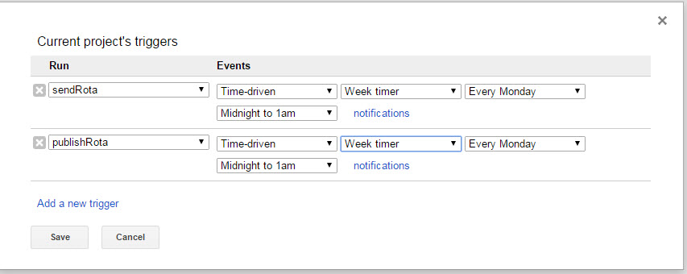
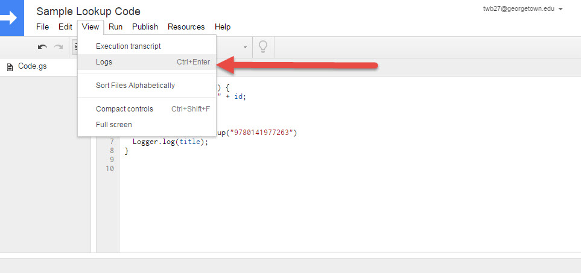
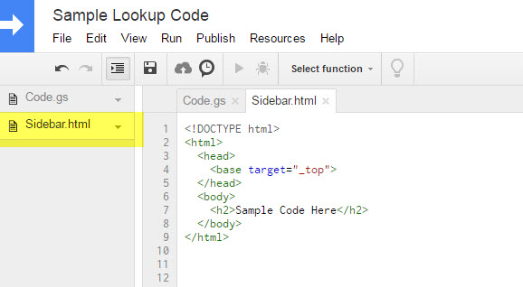

# What is Google App Script?
Google App Script is a server-side implementation of JavaScript with access to several Google API's.

[Google Apps Script Documentation](https://developers.google.com/apps-script/)

***

# How can Google App Script be Used?
- Accessible as a standalone Google Script project on Google Drive
  - Runnable on demand from the script editor
  - Deployable as a web service
  - Schedulable as a trigger (time-driven)
- Embedded in a Google Document, a Google Sheet, a Google Form, or a Google Site
  - Runnable from a custom menu item
  - Triggered by a user event (on Edit action)
  - Availabe as a spreadhseet formula
  - All of the standalone script options are also available for embedded scripts
- Packaged for the Chrome Store as an Add-On
  - Offered for Sale to the Public
  - Offered for Free to the Public
  - Offered for Free to your Apps Domain
  - Offered Privately by URL
  
***
  
# Why Use Google Apps Script?
- It is available where your users already are
  - No need to introduce another login
  - Sharable using existing Google Drive sharing options
  - Configuratable Authorization
    - Script can run as the user running the script
    - Script can run as the author of the script
    - Script can be authorized to access personal Google Services (Mail, Calendar, Drive)
  - User must authorize the permissions granted to the script
- Sometimes a Document or a Spreadsheet provides the correct level of complexity to solve a problem

***
# Complete App Examples
- Extending Google Apps
- Building a Web Service to Save to Google Drive
***
# Example 1: Weekly Scheduling with Google Sheets
- Volunteer assignment spreadsheet
- Volunteer coordinators had limited computer literacy
- [Sample Spreadsheet](https://docs.google.com/spreadsheets/d/1T_AnSoz893QY1IL9uH9L8mH220Wp6WE_Weaq3VkxOX4/edit#gid=0)
  - Make an edit
  - Send email
  - Publish to [Google Sites](https://sites.google.com/a/georgetown.edu/examples/rotasearch)
- [Code on GitHub](https://github.com/terrywbrady/OnlineRota_GoogleAppsScript)
- Try it yourself
  - Select "Make a Copy" to save an editable copy
  - Set up google sites if applicable
  - TBD: Make Google Sites more Accessible
  - Create a trigger to call "sendRota" on a daily basis
- [Sample Screen Shots](https://github.com/terrywbrady/OnlineRota_GoogleAppsScript/blob/master/README.md)
  
***
# Example 1a: Scheduling a Time-Based Trigger
You can set time-based processes to execute your scripts on a regular basis.




***
# Example 2: A Web Service to Upload a CSV to Google Sheets
- Auto-correct in Excel and Google Sheets is a frequent problem for librarians editing metadata
- CSV files can be corrupted when shared between useers
- [Sample Script Project](https://script.google.com/a/georgetown.edu/d/13HcFhMle_oIBTfhuZEya_zQHAokJjgZEdqTEoOTeEfrpx5UpTmNUh_pB/edit?usp=drive_web)
- Try it yourself
  - Select "Make a Copy" to save an editable copy
  - Click "Deploy as Webapp", set the run as parameters as appropriate to you
  - Get the current web app URL
  - Run the Web App to upload a CSV file
- [Sample Screen Shots](https://github.com/Georgetown-University-Libraries/PlainTextCSV_GoogleAppsScript/blob/master/README.md)
  
***
# Creating a Test Google Sheet
- Create a new Google Sheet
- Enter the following Data

|ISBN|Google Books Lookup|
|---|---|
|9780141977263||
|9780590328197||

***
# Create a Script within the Sheet
- Tools -> Script Editor
- This will open up the App Script Cloud IDE
- Add the following script code
```
function isbnLookup(id) {
    return "Sample ISBN Lookup " + id;
}
function test() {
  var title = isbnLookup("9780141977263")
  Logger.log(title);
}
```
- Save the Script Project, name it "Test Project"

***
# Test the script
- From the "Select function" drop down, select "test" and click the "Run" or "Debug" button 

- Click "View Logs" to confirm that the function ran.


***
# Use the script as a Spreadsheet formula
- Modify cell B2 to contain the following formula `=isbnLookup(A2)`
- Copy cell B2 into cell B3 to create the following formula `=isbnLookup(A3)`
- Verify that the cell contents display the result of the function


***
# Enhance the script with an external service call
- [Google Apps Script API Reference for UrlFetchApp](https://developers.google.com/apps-script/reference/url-fetch/url-fetch-app)
- Update the isbnLookup function to use the [Google Books API](https://developers.google.com/books/docs/v1/using#web-applications) to lookup the isbn
```
function isbnLookup(id) {
  var url = "https://www.googleapis.com/books/v1/volumes?country=US&q=isbn:"+id;
  var options = {contentType : "application/json"};
  var resp = UrlFetchApp.fetch(url, options);
  if (resp == null || resp == "") return "N/A";
  var respdata = JSON.parse(resp.getContentText());
  if (respdata["items"].length == 0) return "Not found";
  return respdata["items"][0]["volumeInfo"]["title"];
}
```
- Run the "test()" function again
  - The first time you run this, you will need to authorize Google Apps to send data to an external URL
- Check the logs to verify that "Pride and Prejudice" was found

***
# Reload the Spreadsheet
- The Google Books lookups should now be present


***
# Add Menu to Google Sheets
- Add the following code
```
function onOpen(e) {
  SpreadsheetApp.getUi()
    .createAddonMenu()
    .addItem("Test Function", "test")
    .addToUi();
}
```
- Reload the spreadsheet and note the new menu


***
# Add UI Confirmation to the test() function
- Modify the test() function to access the [Spreadsheet UI](https://developers.google.com/apps-script/reference/spreadsheet/spreadsheet-app#getUi())
```
function test() {
  var title = isbnLookup("9780141977263")
  Logger.log(title);
  SpreadsheetApp.getUi().alert(title);
}
```
- Call the test function from the new menu


***
# Trigger Restrictions
- When installing an onOpen() trigger or other special triggers some [restrictions](https://developers.google.com/apps-script/guides/triggers/) apply to what your script can do
- You may need to simplify the actions performed with a trigger and defer them to a user-driven action
- If you see unexpected behavior in your scripts, evaluate if one of these restrictions has applied

***
# Adding Custom HTML to Your Script
- In the script IDE, create a new html file named "Sidebar.html"
```
<!DOCTYPE html>
<html>
  <head>
    <base target="_top">
  </head>
  <body>
    <h2>Sample Code Here</h2>
  </body>
</html>
```


***
# Add a menu option to load the sidebar
- Create a function showSidebar()
```
function showSidebar() {
  var html = HtmlService.createHtmlOutputFromFile("Sidebar.html");
  SpreadsheetApp.getUi().showSidebar(html);
}
```
- Add a call to showSidebar() to the Add On Menu
function onOpen(e) {
  SpreadsheetApp.getUi()
    .createAddonMenu()
    .addItem("Test Function", "test")
    .addItem("Show Sidebar", "showSidebar")
    .addToUi();
}


***
# Creating a UI in Google Apps Script
- [Creating a Google Doc Add-On Example](https://developers.google.com/apps-script/quickstart/docs)
- [Templated HTML](https://developers.google.com/apps-script/guides/html/templates)
- [Calling Server Side Functions from Client JavaScript](https://developers.google.com/apps-script/guides/html/reference/run)

